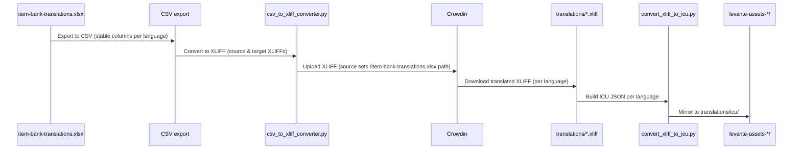

## Levante Localization Pipeline: Source → Crowdin (XLIFF) → Assets and Dashboard

Audience: Engineers and localization PMs working across:
- levante_translations (this repo)
- ../levante-surveys (SurveyJS sources and survey build pipeline)
- ../levante-dashboard (end-user web app that consumes translations)

### What this document covers
- End-to-end flow for all translation sources:
  - SurveyJS schemas from levante-surveys
  - Item bank (item-bank-translations.xlsx / CSV)
  - Dashboard string JSON
- XLIFF-first ground-truth workflow with Crowdin
- Importing back from Crowdin and generating deployable artifacts
- Deployment to GCS assets buckets and preparing JSON for levante-dashboard

## High-level architecture

```mermaid
flowchart TD
  A[Sources<br/>- SurveyJS (levante-surveys)<br/>- Item Bank Excel/CSV (levante_translations)<br/>- Dashboard EN JSON (levante-dashboard)] --> B[Create/Extract XLIFF]

  B --> C[Upload XLIFF → Crowdin<br/>Ground truth managed here]
  C --> D[Download XLIFF from Crowdin]

  D --> E[Convert XLIFF → ICU JSON<br/>xliff/convert_xliff_to_icu.py]
  D --> F[Mirror XLIFF → gs://levante-assets-*/translations/xliff/]
  E --> G[Mirror ICU JSON → gs://levante-assets-*/translations/icu/]

  G --> H[Consumers<br/>- levante-dashboard JSON<br/>- SurveyJS runtime<br/>- Audio Gen & Validation]
```

## Repos and roles

- levante_translations (this repo)
  - XLIFF conversion, Crowdin upload/download tooling
  - GCS deployment and promotion (dev → prod)
  - Helpers to normalize XLIFF and produce ICU JSON per language

- levante-surveys
  - Source of SurveyJS definitions (EN)
  - Build/export SurveyJS assets that are deployed into gs://levante-assets-*

- levante-dashboard
  - Frontend application; consumes per-language JSON or ICU JSON
  - Deployed separately, but translations are prepared here and mirrored to GCS

## Data model and locations

- XLIFF (ground-truth transport)
  - Repo path (GitHub mirror for pipelines): `translations/*.xliff`
  - GCS mirror: `gs://levante-assets-<env>/translations/xliff/`

- ICU JSON (flat key→string for app consumption; AVAILABLE, not used by dashboard/surveys yet)
  - Local output: `xliff/translations-icu/<lang>.json`
  - GCS mirror: `gs://levante-assets-<env>/translations/icu/`

- Raw JSON (current consumption format)
  - levante-dashboard: strings are injected as raw JSON files in the repo
  - levante-surveys: raw JSON is injected into SurveyJS code at build/runtime

- Item bank CSV (input)
  - `translation_text/item_bank_translations.csv` (or source Excel exported to CSV)
  - Converted to XLIFF per-language files

- SurveyJS (inputs/outputs)
  - SurveyJS schemas (EN) in `../levante-surveys`
  - Built surveys are deployed into GCS (typically under `surveys/` prefix)
  - Translations delivered either embedded or fetched via ICU JSON/XLIFF-driven build

## XLIFF-first workflow (Authoritative in Crowdin)

### Authentication (Crowdin)

If you've authorized Crowdin, you can use all upload/download tooling directly. The helpers in this repo look for a token in either location:

- Env var: `CROWDIN_API_TOKEN`
- File: `~/.crowdin_api_token` (single line containing the token)

Some legacy utilities also honor:

- `CROWDIN_TOKEN` (token)
- `CROWDIN_PROJECT_ID` (numeric project id)

Once set, commands like `utilities/crowdin_xliff_manager.py upload|download` will just work.

### 1) Convert sources to XLIFF

Item bank (from CSV/Excel):
- Tool: `utilities/csv_to_xliff_converter.py`
- Produces:
  - `itembank-source-en.xliff` (source-only, `original="item-bank-translations.xlsx"`)
  - `itembank-<lang>.xliff` for targets (e.g., `de`, `de-CH`, `en`, `en-GH`, `es-AR`, `es-CO`, `fr-CA`, `nl`)

Example (item bank):

```bash
python utilities/csv_to_xliff_converter.py \
  --input translation_text/item_bank_translations.csv \
  --output-dir xliff-production \
  --source-lang en \
  --original item-bank-translations.xlsx \
  --emit-source
```

Outputs (examples):
- `xliff-production/itembank-source-en.xliff`
- `xliff-production/itembank-es-CO.xliff`

SurveyJS and dashboard JSON:
- Extract EN source strings (keys/ids aligned to Crowdin)
- Create XLIFF 1.2 files mirroring those keys and original filenames
- Keep `trans-unit` `id`/`resname` stable across repos

### 2) Upload XLIFF to Crowdin

Tool: `utilities/crowdin_xliff_manager.py`
- Requires `CROWDIN_API_TOKEN` (env or `~/.crowdin_api_token`)

```bash
python utilities/crowdin_xliff_manager.py upload \
  --project-id <CROWDIN_PROJECT_ID> \
  --source-dir xliff-production/
```

Notes:
- XLIFF 1.2 structure with `<file original="...">` aligned to Crowdin’s file path (`/item-bank-translations.xlsx`, etc.)
- The “source-only” file establishes the project’s source file
- Upload bilingual XLIFFs when migrating existing translations

### 3) Translate in Crowdin
- Crowdin holds the ground truth
- Translators work in Crowdin, with authoritative state and approvals

### 4) Download XLIFF from Crowdin

Tool: `utilities/crowdin_xliff_manager.py`

Features:
- Normalization on download to fill empty targets when source and target language match
- Downloads one XLIFF per `<source file, target language>`

```bash
python utilities/crowdin_xliff_manager.py download \
  --project-id <CROWDIN_PROJECT_ID> \
  --output-dir xliff-downloads/
```

### 5) Convert XLIFF → ICU JSON

Tool: `xliff/convert_xliff_to_icu.py`
- Generates per-language ICU JSON suitable for apps (levante-dashboard, SurveyJS runtime, validation tools)

```bash
python xliff/convert_xliff_to_icu.py \
  --repo levante-framework/levante_translations \
  --ref l10n_pending \
  --path translations \
  --output-dir xliff/translations-icu
```

Output: `xliff/translations-icu/<lang>.json`

## Deployment to GCS assets

### Buckets and prefixes
- Dev: `gs://levante-assets-dev`
- Prod: `gs://levante-assets-prod`
- Prefixes:
  - `translations/xliff/` for XLIFF mirrors
  - `translations/icu/` for ICU JSON mirrors (future dashboard/surveys use)
  - `surveys/` for SurveyJS assets (if deployed)

### Orchestration and commands

Primary script: `deploy_translations.py`

Capabilities:
- Mirror ICU JSON to assets
- Mirror XLIFF (from GitHub) to assets
- Promote dev → prod (no direct local → prod without `--promote`)
- Safe rsync by default (with `--no-delete` support already integrated)

Run (dev):

```bash
# CSV to dashboard bucket + mirror ICU JSON + XLIFF from GitHub to levante-assets-dev
python deploy_translations.py dev
```

NPM shortcuts (from `package.json` in this repo):

```bash
npm run deploy:translations-dev           # deploy to dev (no-delete default)
npm run deploy:translations-dev-dry       # dry run
npm run deploy:levante-dev                # CSV-only path to dashboard bucket
```

Promotion:

```bash
python deploy_translations.py --promote --languages es-CO
```

- Promotes from `levante-assets-dev` → `levante-assets-prod` for selected languages
- Also supports skipping ICU or XLIFF during promotion

Mirroring XLIFF straight from GitHub to assets:
- `deploy_xliff_to_assets_from_github()` fetches `translations/*.xliff` from the `l10n_pending` branch and rsyncs to `gs://.../translations/xliff/`

Mirroring ICU JSON:
- `deploy_icu_to_assets()` rsyncs `xliff/translations-icu/` → `gs://.../translations/icu/`

Notes:
- `--no-delete` is supported to prevent remote deletions
- Force rebuilds and validation capabilities are available as flags in `deploy_translations.py`

## SurveyJS (levante-surveys) integration


Implementation notes (current):
- SurveyJS EN schemas are the source of truth for structure and identifiers
- Use the same keys/ids in `trans-unit` `resname`/`id`
- TODAY: Surveys inject raw JSON translations directly (no ICU JSON fetch)
- FUTURE: Survey runtime to fetch ICU JSON from `gs://levante-assets-*/translations/icu/` per locale
- Surveys themselves (HTML/bundles) are deployed under `gs://levante-assets-*/surveys/`

## Item bank (item-bank-translations.xlsx / CSV) integration



## Dashboard (levante-dashboard) translations

Current behavior:
- Raw JSON translations are committed in the dashboard repo and imported directly by the code

Future behavior (recommended):
- Fetch per-language ICU JSON at runtime from `gs://levante-assets-*/translations/icu/`
- Remove dashboard-embedded raw JSON and rely on the bucket as the source of app runtime strings

Interim option:
- Copy `xliff/translations-icu/<lang>.json` into `../levante-dashboard/public/i18n/<lang>.json` while migrating

## Command cheat-sheet

Convert item bank CSV → XLIFF (source + target files):

```bash
python utilities/csv_to_xliff_converter.py \
  --input translation_text/item_bank_translations.csv \
  --output-dir xliff-production \
  --source-lang en \
  --original item-bank-translations.xlsx \
  --emit-source
```

Upload XLIFF to Crowdin (ground truth):

```bash
python utilities/crowdin_xliff_manager.py upload \
  --project-id <CROWDIN_PROJECT_ID> \
  --source-dir xliff-production/
```

Download XLIFF from Crowdin:

```bash
python utilities/crowdin_xliff_manager.py download \
  --project-id <CROWDIN_PROJECT_ID> \
  --output-dir xliff-downloads/
```

Convert XLIFF → ICU JSON:

```bash
python xliff/convert_xliff_to_icu.py \
  --repo levante-framework/levante_translations \
  --ref l10n_pending \
  --path translations \
  --output-dir xliff/translations-icu
```

Mirror ICU JSON to assets (dev):

```bash
python deploy_translations.py dev
# or
npm run deploy:translations-dev
```

Promote dev → prod:

```bash
python deploy_translations.py --promote --languages es-CO
```

## Operational guidance and gotchas

- XLIFF normalization on download
  - We normalize XLIFF upon download to fill empty `<target>` when source==target language, improving round-trip completeness

- GCS safety
  - We default to no-deletion rsync in this project to prevent accidental removals (`--no-delete` supported across deploy scripts)

- Environments
  - Dev: `levante-assets-dev`; Prod: `levante-assets-prod`
  - Promote from dev → prod rather than deploying straight to prod

- Alignment of keys/ids
  - Ensure SurveyJS, item bank, and dashboard keys are stable across repos and XLIFF; we use `trans-unit` `resname`/`id` to keep alignment

- ICU JSON vs XLIFF
  - XLIFF is the authoritative round-trip format for translators (Crowdin)
  - TODAY: Both dashboard and surveys consume raw JSON checked into their repos
  - FUTURE: Move to reading ICU JSON from the bucket for both dashboard and surveys
  - LATER: Consider direct XLIFF/Crowdin-export consumption; JSON:ICU becomes optional/deprecated

### Performance note: XLIFF is not a runtime format

- XLIFF is a verbose, XML-based interchange format optimized for translation tooling—not for end-user delivery.
- Serving XLIFF directly to clients is inefficient (size, parsing cost, locale merging, and fallback handling).
- RECOMMENDATION: Always pre-convert XLIFF → a compact runtime format (e.g., JSON:ICU) before it becomes part of the user workflow.
  - Store JSON:ICU in `gs://levante-assets-*/translations/icu/`.
  - Clients (dashboard/surveys) load only the locale they need, with HTTP caching/CDN.
  - Keep XLIFF strictly for round‑trip with Crowdin and internal pipelines.

- Where to add, fix, or re-run
  - Add/modify sources in levante-surveys (SurveyJS), item bank Excel/CSV (this repo), or dashboard EN JSON (levante-dashboard)
  - Recreate XLIFF and re-upload to Crowdin for any schema/key changes
  - Re-download XLIFF, convert to ICU JSON, mirror to assets, and refresh dashboard and surveys

## Appendix: Minimal E2E for item bank

1) Convert CSV → XLIFF
2) Upload XLIFF to Crowdin
3) Translate/approve in Crowdin
4) Download XLIFF from Crowdin
5) Convert to ICU JSON
6) Mirror ICU JSON to `gs://levante-assets-dev/translations/icu/`
7) Optionally copy those JSONs into `../levante-dashboard` and commit

This document encodes the practical steps and scripts observed in this repo; the SurveyJS and levante-dashboard repos focus on source and consumer sides respectively. Use XLIFF as the bridge to Crowdin and ICU JSON as the standardized app format across Levante.

## Future direction (optional, planned)

- Pure-XLIFF consumption path:
  - Treat XLIFF as the single delivery artifact for apps and build systems
  - Optionally generate ICU JSON only for legacy clients during a transition window
  - Update dashboard and survey runtimes to support XLIFF ingestion (with lightweight client-side or build-time conversion)


