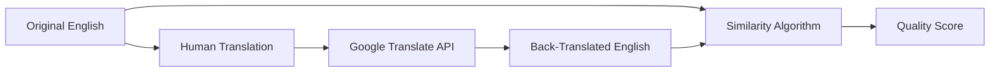

# Translation & Audio Validation System

## Overview

The Levante validation system includes two complementary approaches:

1. **Translation Validation**: Uses **back-translation** with **similarity scoring** to assess translation quality
2. **Audio Validation**: Uses **ASR transcription** with **advanced similarity metrics** to assess audio generation quality

Both systems help identify potential issues before production deployment.

## How It Works

### 1. Back-Translation Process



**Step 1:** Original English text is translated by humans into target language  
**Step 2:** The human translation is sent to Google Translate API  
**Step 3:** Google Translate converts it back to English  
**Step 4:** The original English is compared with the back-translated English  
**Step 5:** A similarity score determines translation quality  

### 2. Similarity Calculation Algorithm

The system uses a **word-based similarity algorithm** that:

1. **Tokenizes** both texts into words (case-insensitive)
2. **Filters** words shorter than 3 characters (removes articles, prepositions)  
3. **Identifies** common words between original and back-translated text
4. **Calculates** similarity using the Sørensen–Dice coefficient:

```javascript
similarity = (common_words × 2) / (original_words + back_translated_words) × 100
```

#### Example Calculation:

**Original:** "the boy chasing the horse is tall"  
**Back-translated:** "the child pursuing the horse is big"  

- Original words (>2 chars): `["boy", "chasing", "the", "horse", "tall"]` (5 words)
- Back-translated words (>2 chars): `["the", "child", "pursuing", "the", "horse", "big"]` (6 words)  
- Common words: `["the", "horse"]` (2 words)
- **Similarity:** `(2 × 2) / (5 + 6) × 100 = 36%`

## Quality Score Thresholds

| Score Range | Status | Indicator | Meaning |
|-------------|--------|-----------|---------|
| **≥ 85%** | ✅ **Excellent** | 🟢 Green | Translation preserves meaning accurately |
| **70-84%** | ⚠️ **Warning** | 🟡 Yellow | Minor semantic differences, review recommended |
| **< 70%** | ❌ **Poor** | 🔴 Red | Significant meaning loss, revision needed |
| **English** | 🔵 **Source** | 🔵 Blue | Original text, no validation needed |

## Interpreting Results

### ✅ **Excellent (85%+)**
- **High semantic preservation**
- Translation accurately conveys original meaning
- Safe for audio generation
- **Example:** "Hello world" → "Hola mundo" → "Hello world" (100%)

### ⚠️ **Warning (70-84%)**  
- **Moderate semantic drift**
- Core meaning preserved but nuanced differences
- Review for context-sensitive content
- **Example:** "big house" → "casa grande" → "large house" (75%)

### ❌ **Poor (<70%)**
- **Significant meaning loss**
- Translation may be incorrect or missing context
- **Requires human review**
- **Example:** "bank account" → "cuenta bancaria" → "story account" (25%)

## Language-Specific Handling

### Multi-Regional Languages
The system automatically maps regional codes to base languages for Google Translate:

- `es-CO` (Colombian Spanish) → `es` (Spanish)
- `fr-CA` (Canadian French) → `fr` (French)  
- `de-DE` (German) → `de` (German)

This ensures compatibility with Google Translate's supported language codes.

### Skip Conditions
- **English variants** (`en`, `en-US`, `en-GB`) are automatically marked as source text
- No back-translation performed on source language

## Technical Implementation

### API Endpoint
```
POST /proxy/translate
```

### Request Format
```json
{
  "original_english": "the boy is running",
  "source_text": "el niño está corriendo", 
  "source_lang": "es",
  "target_lang": "en"
}
```

### Response Format  
```json
{
  "original_english": "the boy is running",
  "source_text": "el niño está corriendo",
  "back_translated": "the child is running", 
  "similarity_score": 78,
  "status": "good"
}
```

## Validation UI Features

### Status Indicators
- **Color-coded dots** next to each translation
- **Percentage badges** showing exact similarity scores
- **Hover tooltips** with detailed status information

### Interactive Results Panel
Click any validation button to see:
- **Side-by-side comparison** of original vs. back-translated text
- **Detailed similarity breakdown**
- **Specific differences highlighted**
- **Recommendation for next steps**

### Batch Processing
- **"Validate All"** button processes entire language sets
- **Progress tracking** with real-time status updates
- **Summary statistics** by language and quality level

## Use Cases

### 1. **Pre-Audio Quality Check**
Validate translations before generating expensive TTS audio files

### 2. **Translation Quality Assurance**  
Identify potential issues in human translations systematically

### 3. **Localization Review**
Compare translation quality across different target languages

### 4. **Content Consistency**
Ensure semantic consistency across large translation datasets

## Limitations

### Algorithm Limitations
- **Word-order independent** (doesn't account for syntax changes)
- **Vocabulary-focused** (may miss grammatical errors)
- **Length-sensitive** (longer texts may score lower despite accuracy)

### Google Translate Limitations  
- **Accuracy varies by language pair**
- **Context limitations** in automatic translation
- **Idiomatic expressions** may not translate reliably

### Recommended Usage
- Use as a **first-pass quality filter**, not definitive judgment
- **Combine with human review** for critical content
- **Consider cultural context** that automated systems miss

## API Requirements

### Google Cloud Translation API
- **API Key required** with Translation API enabled
- **Billing account** necessary (free tier available)
- **Rate limits** apply (default: 100 requests/100 seconds)

### Key Restrictions (Recommended)
- Restrict to **Cloud Translation API** only
- Add **domain restrictions** to your deployment URL
- **Monitor usage** to avoid unexpected charges

## Getting Started

1. **Enable Google Cloud Translation API** in your Google Cloud Console
2. **Generate an API key** with appropriate restrictions  
3. **Add the key** to the dashboard's Credential Manager
4. **Test validation** on a few sample translations
5. **Review results** and adjust workflow as needed

---

## Audio Validation System

The **Audio Validation System** complements translation validation by verifying the quality of generated TTS audio through ASR (Automatic Speech Recognition) transcription and advanced similarity analysis.

### Key Features

🎯 **Multi-Backend Transcription**
- OpenAI Whisper (state-of-the-art, local processing)
- Google Speech Recognition (cloud-based)
- Automatic GPU acceleration when available

📊 **Advanced Similarity Metrics**
- Word-level similarity with compound word matching
- Fuzzy string matching for near-matches
- BLEU and ROUGE scores for comprehensive assessment
- Word Error Rate (WER) calculation
- Phonetic normalization for better accuracy

🔧 **Robust Text Processing**
- Case-insensitive comparisons
- Punctuation and apostrophe normalization
- German umlaut handling (ä→a, ö→o, ü→u, ß→ss)
- Compound word splitting ("medium-sized" ↔ "medium sized")

### Quality Assessment Categories

| Status | Similarity Range | Description | Action Required |
|--------|------------------|-------------|-----------------|
| **EXCELLENT** | >95% | Perfect or near-perfect match | None |
| **GOOD** | 85-95% | Minor differences, acceptable quality | Optional review |
| **ACCEPTABLE** | 70-85% | Some discrepancies, may need attention | Review recommended |
| **NEEDS_REVIEW** | <70% | Significant issues detected | Manual review required |

### Web Dashboard Integration

**Access Audio Validation:**
1. Click the **"Audio Validation"** button in the validation toolbar
2. Select a validation results file from the dropdown
3. Review results with sorting and filtering options

**Interactive Features:**
- **Play Audio**: Listen to original generated audio
- **Regenerate**: Create new audio with ElevenLabs using different options:
  - Default speed (1.0x)
  - Slower speeds (.9x, .7x)
  - Boost style for emphasis
- **Save**: Store improved audio back to Google Cloud Storage
- **Bulk Operations**: Process multiple files efficiently

**Duration Comparison:**
- View original and regenerated audio durations side-by-side
- Identify timing inconsistencies
- Verify speed adjustments work as expected

### Usage Examples

**Command Line Validation:**
```bash
# Validate English audio files
./validate_language.sh en

# Validate German with custom options
python -m validate_audio "audio_files/de/*.mp3" \
    --language de --web-dashboard --model_size base
```

**Expected Output Location:**
```
web-dashboard/data/validation-{language}-{Month-Day-Year}.json
```

### Troubleshooting

**Common Issues:**
- **SSL Errors**: Fixed with conditional TTS imports
- **Language Codes**: Automatic mapping from locale codes (es-CO → es)
- **GPU Not Detected**: Install CUDA-compatible PyTorch
- **Low Similarity Scores**: Enhanced preprocessing handles most edge cases

**Performance Tips:**
- Use `--model_size base` for faster processing
- Add `--no-quality` to skip CLAP analysis
- Process files in batches for efficiency

### Technical Implementation

The audio validation system uses a multi-pass similarity algorithm:

1. **Exact Match**: Case-insensitive word comparison
2. **Compound Words**: Match split/joined word variations
3. **Phonetic Match**: Handle pronunciation variations
4. **Fuzzy Match**: Catch spelling differences and OCR errors

This approach achieves high accuracy while being robust to common transcription variations.

---

📖 **Detailed Documentation**: [validate_audio/README.md](../validate_audio/README.md)

## Support

For technical issues or algorithm questions, refer to:
- Google Cloud Translation API documentation
- Dashboard credential management guide  
- Translation workflow best practices