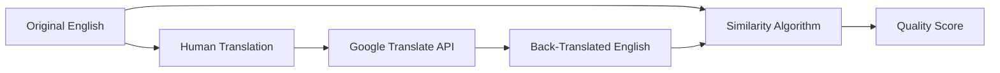

# Translation Validation System

## Overview

The Translation Validation System uses **back-translation** combined with **similarity scoring** to automatically assess the quality of translations. This approach helps identify potential translation errors, missing context, or semantic drift before audio generation.

## How It Works

### 1. Back-Translation Process



**Step 1:** Original English text is translated by humans into target language  
**Step 2:** The human translation is sent to Google Translate API  
**Step 3:** Google Translate converts it back to English  
**Step 4:** The original English is compared with the back-translated English  
**Step 5:** A similarity score determines translation quality  

### 2. Similarity Calculation Algorithm

The system uses a **word-based similarity algorithm** that:

1. **Tokenizes** both texts into words (case-insensitive)
2. **Filters** words shorter than 3 characters (removes articles, prepositions)  
3. **Identifies** common words between original and back-translated text
4. **Calculates** similarity using the Sørensen–Dice coefficient:

```javascript
similarity = (common_words × 2) / (original_words + back_translated_words) × 100
```

#### Example Calculation:

**Original:** "the boy chasing the horse is tall"  
**Back-translated:** "the child pursuing the horse is big"  

- Original words (>2 chars): `["boy", "chasing", "the", "horse", "tall"]` (5 words)
- Back-translated words (>2 chars): `["the", "child", "pursuing", "the", "horse", "big"]` (6 words)  
- Common words: `["the", "horse"]` (2 words)
- **Similarity:** `(2 × 2) / (5 + 6) × 100 = 36%`

## Quality Score Thresholds

| Score Range | Status | Indicator | Meaning |
|-------------|--------|-----------|---------|
| **≥ 85%** | ✅ **Excellent** | 🟢 Green | Translation preserves meaning accurately |
| **70-84%** | ⚠️ **Warning** | 🟡 Yellow | Minor semantic differences, review recommended |
| **< 70%** | ❌ **Poor** | 🔴 Red | Significant meaning loss, revision needed |
| **English** | 🔵 **Source** | 🔵 Blue | Original text, no validation needed |

## Interpreting Results

### ✅ **Excellent (85%+)**
- **High semantic preservation**
- Translation accurately conveys original meaning
- Safe for audio generation
- **Example:** "Hello world" → "Hola mundo" → "Hello world" (100%)

### ⚠️ **Warning (70-84%)**  
- **Moderate semantic drift**
- Core meaning preserved but nuanced differences
- Review for context-sensitive content
- **Example:** "big house" → "casa grande" → "large house" (75%)

### ❌ **Poor (<70%)**
- **Significant meaning loss**
- Translation may be incorrect or missing context
- **Requires human review**
- **Example:** "bank account" → "cuenta bancaria" → "story account" (25%)

## Language-Specific Handling

### Multi-Regional Languages
The system automatically maps regional codes to base languages for Google Translate:

- `es-CO` (Colombian Spanish) → `es` (Spanish)
- `fr-CA` (Canadian French) → `fr` (French)  
- `de-DE` (German) → `de` (German)

This ensures compatibility with Google Translate's supported language codes.

### Skip Conditions
- **English variants** (`en`, `en-US`, `en-GB`) are automatically marked as source text
- No back-translation performed on source language

## Technical Implementation

### API Endpoint
```
POST /proxy/translate
```

### Request Format
```json
{
  "original_english": "the boy is running",
  "source_text": "el niño está corriendo", 
  "source_lang": "es",
  "target_lang": "en"
}
```

### Response Format  
```json
{
  "original_english": "the boy is running",
  "source_text": "el niño está corriendo",
  "back_translated": "the child is running", 
  "similarity_score": 78,
  "status": "good"
}
```

## Validation UI Features

### Status Indicators
- **Color-coded dots** next to each translation
- **Percentage badges** showing exact similarity scores
- **Hover tooltips** with detailed status information

### Interactive Results Panel
Click any validation button to see:
- **Side-by-side comparison** of original vs. back-translated text
- **Detailed similarity breakdown**
- **Specific differences highlighted**
- **Recommendation for next steps**

### Batch Processing
- **"Validate All"** button processes entire language sets
- **Progress tracking** with real-time status updates
- **Summary statistics** by language and quality level

## Use Cases

### 1. **Pre-Audio Quality Check**
Validate translations before generating expensive TTS audio files

### 2. **Translation Quality Assurance**  
Identify potential issues in human translations systematically

### 3. **Localization Review**
Compare translation quality across different target languages

### 4. **Content Consistency**
Ensure semantic consistency across large translation datasets

## Limitations

### Algorithm Limitations
- **Word-order independent** (doesn't account for syntax changes)
- **Vocabulary-focused** (may miss grammatical errors)
- **Length-sensitive** (longer texts may score lower despite accuracy)

### Google Translate Limitations  
- **Accuracy varies by language pair**
- **Context limitations** in automatic translation
- **Idiomatic expressions** may not translate reliably

### Recommended Usage
- Use as a **first-pass quality filter**, not definitive judgment
- **Combine with human review** for critical content
- **Consider cultural context** that automated systems miss

## API Requirements

### Google Cloud Translation API
- **API Key required** with Translation API enabled
- **Billing account** necessary (free tier available)
- **Rate limits** apply (default: 100 requests/100 seconds)

### Key Restrictions (Recommended)
- Restrict to **Cloud Translation API** only
- Add **domain restrictions** to your deployment URL
- **Monitor usage** to avoid unexpected charges

## Getting Started

1. **Enable Google Cloud Translation API** in your Google Cloud Console
2. **Generate an API key** with appropriate restrictions  
3. **Add the key** to the dashboard's Credential Manager
4. **Test validation** on a few sample translations
5. **Review results** and adjust workflow as needed

## Support

For technical issues or algorithm questions, refer to:
- Google Cloud Translation API documentation
- Dashboard credential management guide  
- Translation workflow best practices